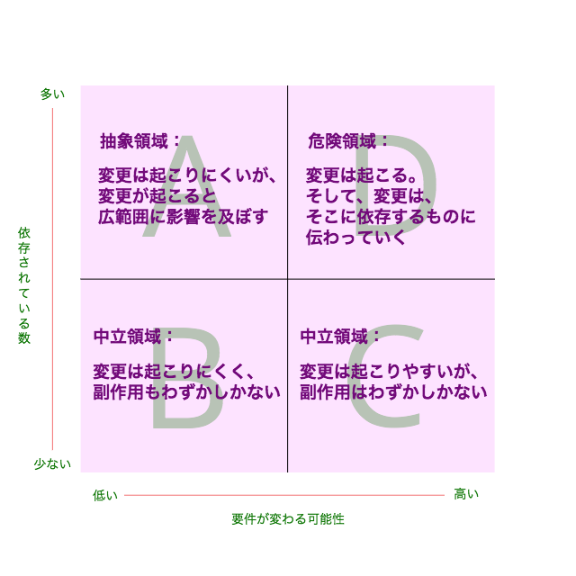

## 3.3 依存方向の管理

### 依存関係の逆転

Wheel をGear やratio に依存させることもできる

```ruby
class Gear
  attr_reader :chainring, :cog

  def initialize(chainring, cog)
    @chainring = chainring
    @cog = cog
  end

  def gear_inches(diameter)
    ratio * diameter
  end

  def ratio
    chainring / cog.to_f
  end

  # ...
end

class Wheel
  attr_reader :rim, :tire, :gear

  def initialize(rim, tire, chainring, cog)
    @rim = rim
    @tire = tire
    @gear = Gear.new(chainring, cog)
  end

  def diameter
    rim + (tire * 2)
  end

  def gear_inches
    gear.gear_inches(diameter)
  end
  # ...
end

puts Wheel.new(52, 11, 52, 11).gear_inches # => 349.8181818181818
```

### 依存方向の選択

- あるクラスは、他のクラスよりも要件が変わりやすい
- 具象クラスは、抽象クラスよりも変わる可能性が高い
- 多くのところから依存されたクラスを変更すると、広範囲に影響が及ぶ

◉ 問題となる依存関係を見つける



