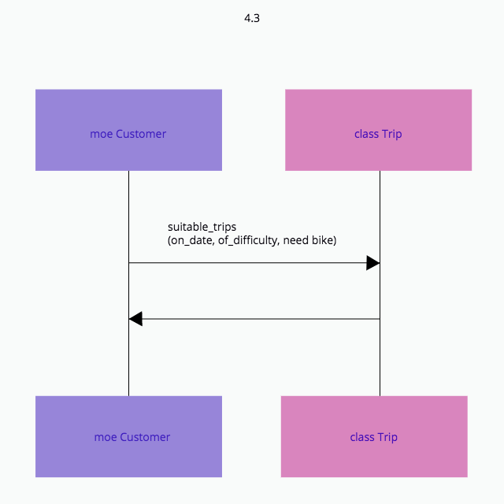
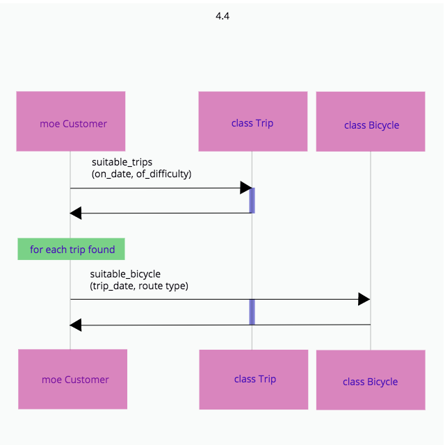
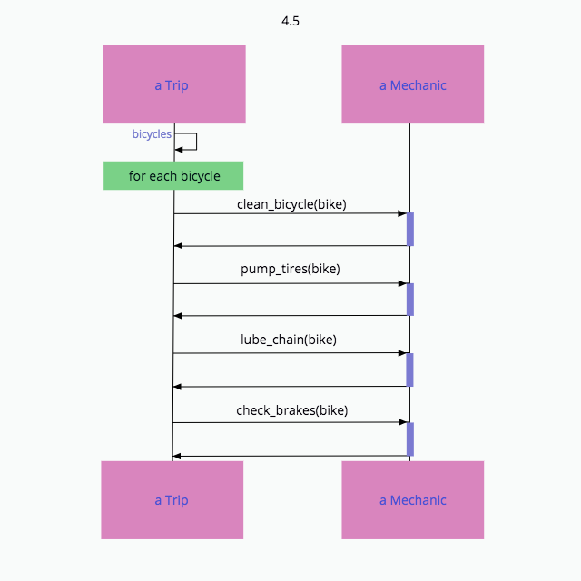
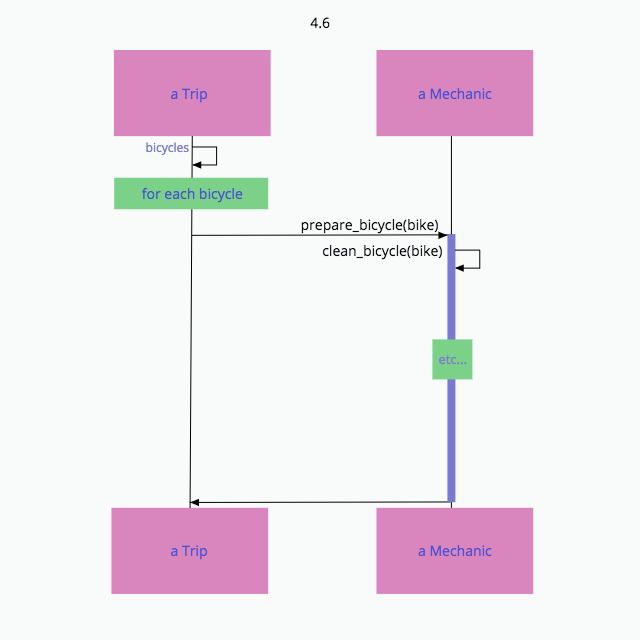
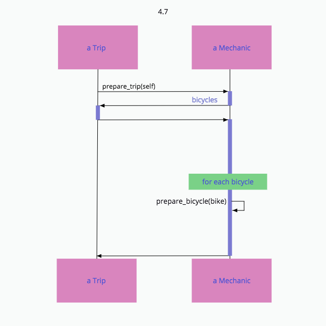
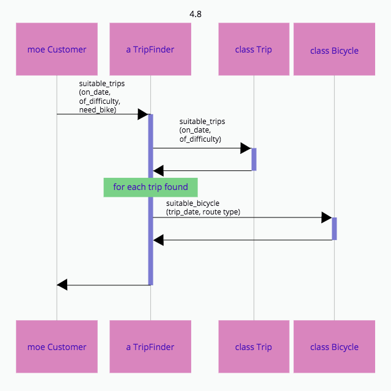

## 4.3 パブリックインターフェースを見つける

ユースケース：「参加者は、旅行を選ぶために、適切な難易度の、特定の日付の、自転車を借りられる旅行の一覧を見たい」

#### 図4.3

疑問：「Tripは、適切な旅行のそれぞれに対し、適切な自転車が利用可能かどうかを調べる責任を負うべきなのだろうか？」

「このメッセージを送る必要があるけれど、誰が応答すべきなんだろう」

オブジェクトが存在するからメッセージを送るのではない。メッセージを送るためにオブジェクトが存在する

問題はCustomerがsuitable_trips メッセージを送るべきでないということではなく、Tripが受け取るべきでない、ということ

#### 図4.4

- 旅行の一覧が欲しい
- suitable_trips メッセージを実装するオブジェクトがある
- 適切な旅行を見つけることには、適切な自転車を見つけることも含まれる
- suitable_bicycle メッセージを実装する他のオブジェクトがある

Trip から余計な責任は取り除いたものの、単にそれをCustomer に移したに過ぎない

図4.4 が抱える問題は、Moe 自身が「何を」望むかだけでなく、他のオブジェクトが共同作業をして「どのように」望むものを準備するかまで知っている、ということである

Customer クラスは、他の場所にあるべき責任を取り込んでいるせいで、変わる可能性のある実装に自分自身を縛り付けてしまっている

### 「どのように」を伝えるのではなく「何を」を頼む

ユースケース：「旅行が開始されるためには、使われる自転車が全て整備されていることを確実にする必要がある」

#### 図4.5

- Trip のパブリックインターフェースは bicycles メソッドを含む
- Mechanic のパプリックインターフェースは、clean_bicycle (自転車を洗浄する)、pumps_tires (空気を入れる)、lube_chain (チェーンに油をさす)、check_brakes (ブレーキをチェックする) メソッドを含む
- Trip は clean_bicycle, pump_tires, lubu_chain, check_brakes に応答できるオブジェクトを持ち続けることを想定する

Trip は Mechanic が行うことについて、詳細をいくつも知っており、Mechanic に指示するために使っている

そのため、Mechanic が新たな手順を自転車の準備工程に加えたときは、Trip も変わらなければならない

#### 図4.6

- Trip のパブリックインターフェースはbicycles メソッドを含む
- Mechanic のパブリックインターフェースは、prepare_bicycle メソッドを含む
- Trip は prepare_bicycle に応答できるオブジェクトを持ち続けることを想定する

Trip と Mechanic間の会話が「どのように」から「何を」に変わった時の副作用の一つとして、Mechanic のパブリックインターフェースのサイズが一段と小さくなったことが挙げられる

図4.5 では、Mechanic は数多くのメソッドを外にさらしていたが、図4.6 では、Mechanic のパブリックインターフェースは prepare_bicycle メソッド一つだけ

### コンテキストの独立を模索する

図4.6 では、Trip は、prepare_bicycle メッセージに応答できる Mechanic オブジェクトを持ち続けることを想定していた

旅行の準備には「いつでも」自転車の準備が求められるため、Trip は「常に」prepare_bicycle メッセージを自身の Mechanic へ送らなければならない

prepare_bicycle に応答できる Mechanic のようなオブジェクトを用意しない限り、Trip を再利用するのは不可能

#### 図4.7

Trip は単に Mechanic に対する望み、つまり、準備されることを伝えているだけ。そして、自身を引数として渡している

Trip は Mechanic について何も知らない。Trip は Mechanic に何を望むかを伝え、self を引数として渡す

Mechanic は準備が必要な Bicycle の集まり (bicycles) を得るため、直ちに Trip にコールバックする

- Trip のパブリックインターフェースはbicycles を含む
- Mechanic のパブリックインターフェースは prepare_trip を含む。ひょっとしたら prepare_bicycle も含みうる
- Trip は prepare_trip に応答できるオブジェクトを持ち続けることを想定する
- Mechanic は prepare_trip とともに渡されてきた引数が bicycles に応答することを想定する

### 他のオブジェクトを信頼する

図4.6 では Tripは prepare_bicycle に応答できるオブジェクトを自身が保持していることを知っており、また Trip は「常に」そのオブジェクトを持ち続ける必要がある

図4.7 では Trip が自身が Mechanic を持っていることを知りもしなければ気にもしない。また、Mechanic が何をするかも全く知らない

Trip は単にprepare_trip を送るためのオブジェクトを保持しているだけ

手放しの信頼が、オブジェクト指向設計の要。これにより、オブジェクトは自身をコンテキストに縛り付けることなく、共同作業できるようになる

### オブジェクトを見つけるためにメッセージを使う

図4.3 では、Trip が知り過ぎている。図4.4 では、Customer が知り過ぎている

#### 図4.8

適切な旅行 (suitable_trips) を見つける責任を、TripFinder が負っている
