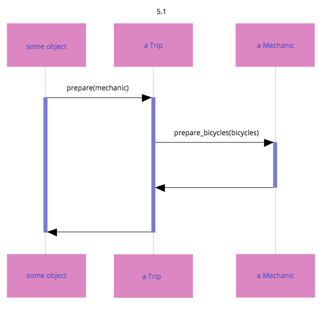
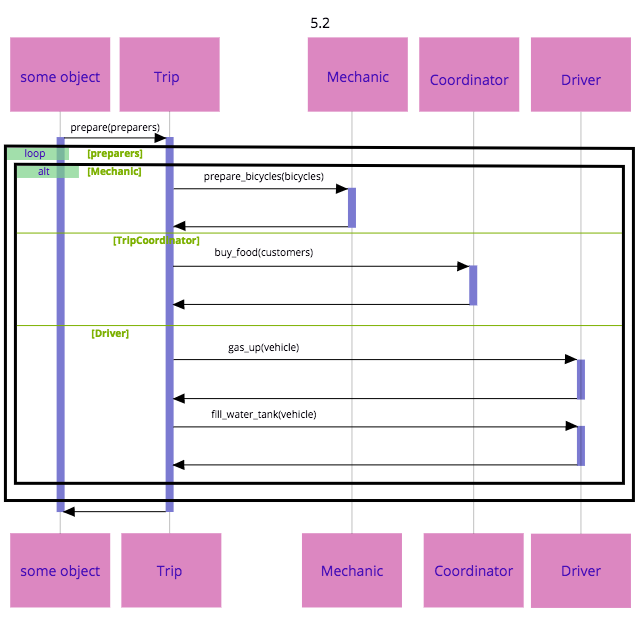
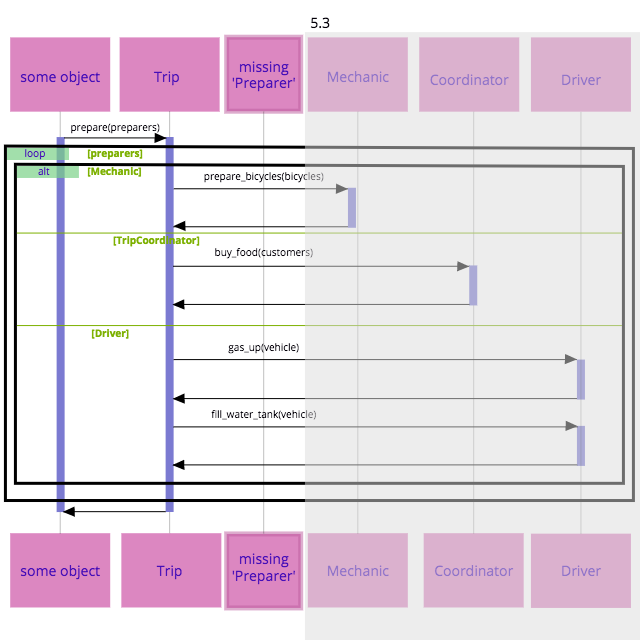
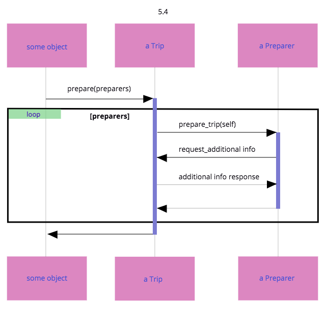

### 第５章 ダックタイピングでコストを削減する

ダックタイプはいかなる特定のクラスとも結びつかないパブリックインターフェースである

この名前は「もしオブジェクトがダック（アヒル）のように鳴き、ダックのように歩くならば、そのクラスが何であれ、それはダックである」という表現に由来する

#### 5.1 ダックタイピングを理解する

重要なのは、オブジェクトが何で「ある」かではなく、「何を」するか

##### ダックを見逃す

```ruby
class Trip
  attr_reader :bicycles, :customers, :vehicle

  # この 'mechanic' 引数はどんなクラスのものでも良い
  def prepare(mechanic)
    mechanic.prepare_bicycles(bicycles)
  end

  # ...
end

# *この* クラスのインスタンスを渡すことになったとしても、動作する
class Mechanic
  def prepare_bicycles(bicycles)
    bicycles.each { |bicycle| prepare_bicycle(bicycle) }
  end

  def prepare_bicycle(bicycle)
    # ...
  end
end
```



prepare メソッドは、Mechanic クラスに対しての明示的な依存こそしていないが、prepare_bicycle に応答できるオブジェクトを受け取る、ということには依存している

Trip のprepare メソッドは、この引数が自転車を準備してくれるものを持っていると、固く信じている


#### 問題を悪化させる

TripCoordinator, Driver クラスを追加、Trip のprepare メソッドも変更

prepare メソッドは異なる３つのクラスを名前で参照している上に、それぞれに実装される具体的なメソッドを知っている

prepare メソッドは、他のどこかの変更によって変更が強制される恐れがある。また、遠くの、関係のない変更によって予期せず壊れる可能性もある

```ruby
class Trip
  attr_reader :bicycles, :customers, :vehicle

  def prepare(preparers)
    preparers.each do |preparer|
      case preparer
      when Mechanic
        preparer.prepare_bicycles(bicycles)
      when TripCoordinator
        preparer.buy_food(customers)
      when Driver
        preparer.gas_up(vehicle)
        preparer.fill_water_tank(vehicle)
      end
    end
  end
end

class Mechanic
  def prepare_bicycles(bicycles)
    bicycles.each { |bicycle| prepare_bicycle(bicycle) }
  end

  def prepare_bicycle(bicycle)
    # ...
  end
end

class TripCoordinator
  def buy_food(customers)
    # ...
  end
end

class Driver
  def gas_up(vehicle)
    # ...
  end

  def fill_water_tank(vehicle)
    # ...
  end
end
```

prepare メソッドの引数は、それぞれ異なるクラスのものであり、異なるメソッドを実装している

そのメッセージを送るかを知るためには、それぞれの引数のクラスを特定しなければならない

prepare メソッドは特定のクラスに依存していて、他のクラスは役に立たない

また、これらのクラスの具体的なメソッド名に依存している

それぞれのクラスが理解するメッセージの名前を、それが必要とする引数とともに知っている。この知識は全てリスクを上げるものである




#### ダックを見つける

依存を取り除くための鍵は「Trip のprepare メソッドは単一の目的を果たすためにあるので、その引数も単一の目的をともに達成するために渡されてくるということを意識すること」

prepare が何を必要とするのか？ 旅行の準備をすること (prepare) を望む

図5.3 ではprepare メソッドにおいて、引数のクラスは想定されていない。代わりに、それぞれが「準備するもの (Preparer)」である




図5.4 は新しいメッセージを導入している

Trip のprepare メソッドは、その引数がprepare_trip に応答できる複数のPreparer であることを想定している



- prepare_trip を実装するオブジェクトは、Preparer である
- 逆に言えば、Preparer と相互作用するオブジェクトに必要なのは、それがPreparer のインターフェースを実装していると信頼することだけ

Mechanic, TripCoordinator, Driver は、Preparer のように振る舞うべき。つまり、prepare_trip を実装するべき


```ruby
class Trip
  attr_reader :bicycles, :customers, :vehicle

  def prepare(preparers)
    preparers.each do |preparer|
      preparer.prepare_trip(self)
    end
  end
end

# 全ての準備者 (Preparer) は 'prepare_trip' に応答するダック
class Mechanic
  def prepare_trip(trip)
    trip.bicycles.each do |bicycle|
      prepare_bicycle
    end
  end

  # ...
end

class TripCoordinator
  def prepare_trip(trip)
    buy_food(trip.customers)
  end

  # ...
end

class Driver
  def prepare_trip(trip)
    vehicle = trip.vehicle
    gas_up(vehicle)
    fill_water_tank(vehicle)
  end

  # ...
end
```

#### ダックタイピングの影響

ダックタイプを見つけたことにより、既存のコードを変更することなくアプリケーションから新しい振る舞いを引き出せるようになった

単純にまた別のオブジェクトをPreparer に変えて、Trip のprepare メソッドに渡せばよい

ダックタイプを使うことで、コードは具象的なものからより抽象的なものへと変わっていく

拡張はより簡単になるものの、ダックの根底にあるクラスは覆い隠される

##### ポリモーフィズム

オブジェクト指向プログラミングでのポリモーフィズムは、多岐にわたるオブジェクトが、同じメッセージに応答できる能力を指す

メッセージの送り手は、受け手のクラスを気にする必要がなく、受け手は、それぞれが独自化した振る舞いを提供する

ポリモーフィズムを獲得するための方法
- ダックタイピング
- 継承
- （Rubyのモジュールを介する）振る舞いの共有

ポリモーフィックなメソッドを実装するどのオブジェクトも、そのメソッドを実装する他のオブジェクトと置き換わることができる。メッセージの送り手は、この置換を知る必要も、気にする必要もない
