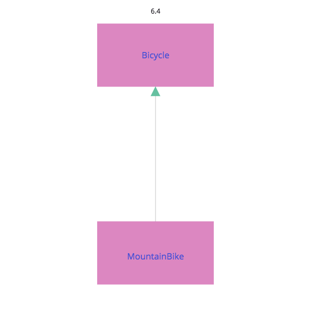

# 第６章 継承によって振る舞いを獲得する

## 6.1 クラスによる継承を理解する

継承とは、根本的に「メッセージの自動移譲」の仕組みに他ならない

## 6.2 継承を使うべき箇所を識別する

### 具象クラスからはじめる

```ruby
class Bicycle
  attr_reader :size, :tape_color

  def initialize(args)
    @size = args[:size]
    @tape_color = args[:tape_color]
  end

  # 全ての自転車は、デフォルト値として同じタイヤサイズとチェーンサイズを持つ
  def spares
    {
      chain: '10-speed',
      tire_size: '23',
      tape_color: tape_color
    }
  end

  # 他にもメソッドがたくさん...
end

bike = Bicycle.new(size: 'M', tape_color: 'red')
puts bike.size
puts bike.spares
```

ここでの設計課題は、マウンテンバイクに対応させること

- マウンテンバイクは自転車
- 全体のサイズ、チェーン、タイヤのサイズは持っている
- ロードバイクとの違いは、マウンテンバイクはサスペンションを備えているということ


### 複数の型を埋め込む

新たに追加されたもの

* front_shock, rear_shock - マウンテンバイク固有の部品
* style - その部品がスペアのリストに現れるかを決定する

```ruby
class Bicycle
  attr_reader :style, :size, :tape_color,
              :front_shock, :rear_shock

  def initialize(args)
    @style = args[:style]
    @size = args[:size]
    @tape_color = args[:tape_color]
    @front_shock = args[:front_shock]
    @rear_shock = args[:rear_shock]
  end

  # 全ての自転車は、デフォルト値として同じタイヤサイズとチェーンサイズを持つ
  def spares
    if style == :road
      {
        chain: '10-speed',
        tire_size: '23', # milimeters
        tape_color: tape_color
      }
    else
      {
        chain: '10-speed',
        tire_size: '2.1', # inches
        rear_shock: rear_shock
      }
    end
  end

  # 他にもメソッドがたくさん...
end

bike = Bicycle.new(
        style: :mountain,
        size: 'S',
        front_shock: 'Manitou',
        rear_shock: 'Fox')

p bike.spares #=> {:chain=>"10-speed", :tire_size=>"2.1", :rear_shock=>"Fox"}
```

新たなstyle を追加するときは、if 文を変更しなければならない

### 埋め込まれた型を見つける

継承は、共通の振る舞いを持つものの、いくつかの面においては異なるという、強く関連した型の問題を解決する

### 継承を選択する

サブクラスは、スーパークラスの全てであり、かつスーパークラスを「上回る」ものである

String のインスタンスはStringであり、同時にObject でもある

全てのString はObject のパブリックインターフェースを全て持っていると想定されるだけでなく、そのインターフェースに定義されるどのメッセージにも、適切にレスポンスを返すことが求められる

サブクラスは、スーパークラスを特化したものと言える

### 継承関係を描く


