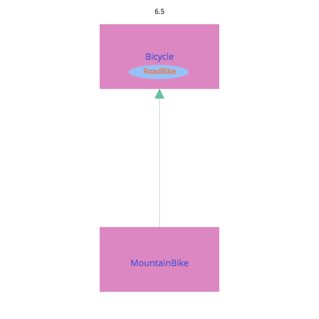

## 6.3 継承を不適切に適用する

```ruby
class MountainBike < Bicycle
  attr_reader :front_shock, :rear_shock

  def initialize(args)
    @front_shock = args[:front_shock]
    @rear_shock = args[:rear_shock]
    super(args)
  end

  def spares
    super.merge(rear_shock: rear_shock)
  end
end

mountain_bike = MountainBike.new(
                size: 'S',
                front_shock: 'Manitou',
                rear_shock: 'Fox')
mountain_bike.size
mountain_bike.spares
```



この図が示すのは、ロードバイクの振る舞いがBicycle の内部に埋め込まれている様子である

MountainBikeは望みもしなければ必要でもない振る舞いを継承することになる
