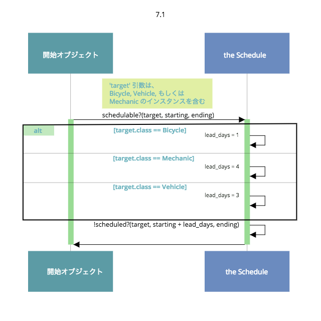
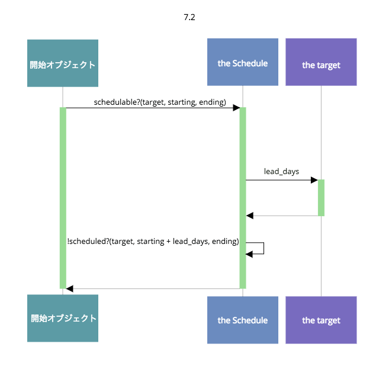
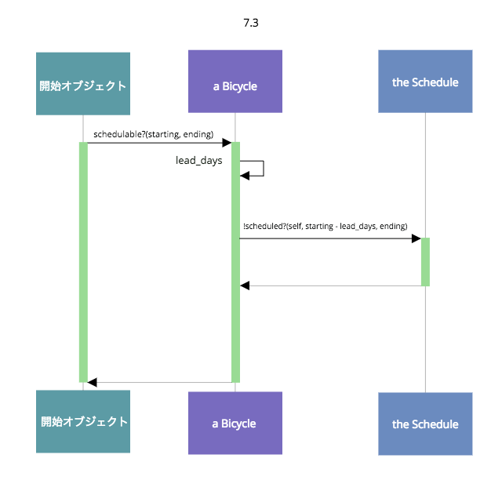
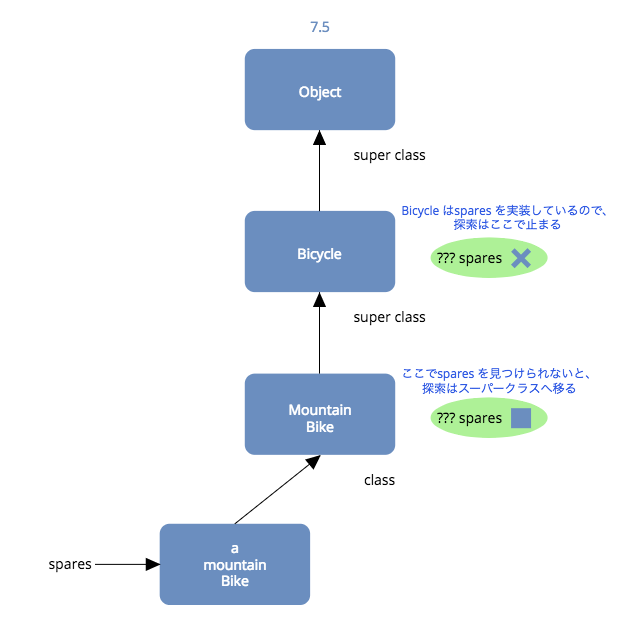
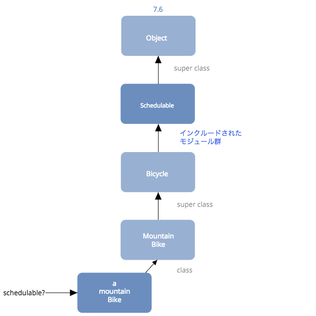
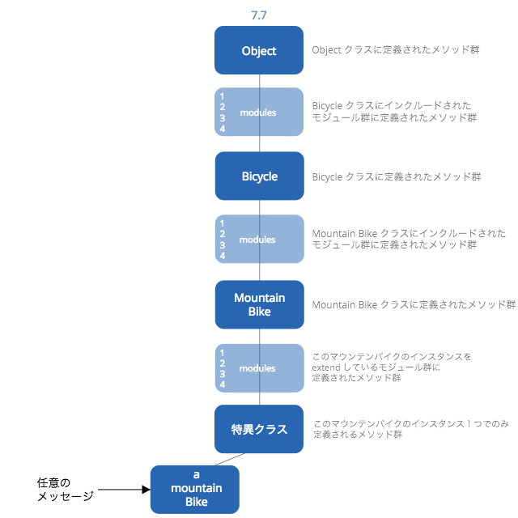

# 第７章 モジュールでロールの振る舞いを共有する

## 7.1 ロールを理解する

### ロールを見つける

振る舞いを共有せねばならないとなると、今度は共有されるコードをどう管理するかという問題が出てくる

理想を言えば、このコードは１箇所に定義されているものの、「ダックタイプとして振舞うことでロールを担いたい」と思っているどんなオブジェクトからも、利用できるようになっているべき

メソッドはモジュール内に定義することができ、モジュールは任意のオブジェクトに追加することができる

オブジェクトが応答できるメッセージの集合には、次の４種類のメッセージが含まれる

- 自身が実装するメッセージ
- 自身より上の階層の、全てのオブジェクトで実装されるメッセージ
- 自身に追加される、全てのモジュールで実装されるメッセージ
- 自身より上の階層のオブジェクトに追加される、全てのモジュールで実装されるメッセージ

### 責任を管理する

Schedule クラスが存在すると仮定する。そのインターフェースには次の３つのメソッドがあるとする

- scheduled?(target, starting, ending)
- add(target, starting, ending)
- remove(target, starting, ending)

Schedule の責任は、引数として渡されてきたtarget (対象のオブジェクト)がすでにスケジュールされているかを確認すること、target のスケジュールへの追加と削除を行うこと

これらの責任は、Schedule 自体に属する




### 不必要な依存関係を取り除く

Schedule はクラス名をいくつも確認した上で、ある変数に代入する値を決定している

このことから、その変数名はそのままメッセージに変え、オブジェクトが渡されるたびにそのメッセージを送るべき

◉ Schedulable ダックタイプを見つける

クラス名の確認をschedulable? メソッドから取り除き、メソッドの代わりにlead_days メッセージを送るようにする

lead_days メッセージは引数で渡されるtarget オブジェクトに送られる

この変更により、オブジェクトにクラス名を聞いていたif 文がメッセージに取って代わられた



tartget はいくつもあるクラスのどのインスタンスでもない

だが図中の箱にはそのまま変数の名前をつけ、lead_days メッセージはそのままこの「target」に送ることにする

Scheduleがtarget のクラスを気にするのではなく、単に特定のメッセージに応答することを期待している

メッセージに基づく期待はクラスの境界を超越し、ロールを明らかにする

◉ オブジェクト自身に自身を語らせる

開始オブジェクトは、target オブジェクトがスケジュール可能かを確かめようとしているが、質問はtarget 自身に聞いていない。代わりに第三者であるSchedule に聞いている

target はschedulable? に応答すべき。schedulable? メソッドはSchedulable ロールのインターフェースに追加されるべき

### 具体的なコードを書く

まず任意の具象クラス (例えばBicycle)を１つ選び、schedulable? メソッドを直接そのクラスに実装する

次はリファクタリングをして、そのSchedulable でも振る舞いを共有できるようなコードの構成にしていく



変更以前では、開始オブジェクトはSchedule について知っている必要があり、Schedule に依存していた

変更後、自転車オブジェクトは自身について語れるようになり、開始オブジェクトは第三者の力を借りなくとも自由に自転車オブジェクトと関われるようになった

```ruby
class Schedule
  def scheduled?(schedulable, start_date, end_date)
    puts "This #{schedulable.class}" + "is not scheduled\n" + " between #{start_date} and #{end_date}"
    false
  end
end

class Bicycle
  attr_reader :schedule, :size, :tire_size

  # Schedule を注入し、初期値を設定する
  def initialize(args={})
    @schedule = args[:schedule] || Schedule.new
    # ...
  end

  # 与えられた期間 (現在はBicycleに固有)の間、
  # bicycle が利用可能であればtrue を返す
  def schedulable?(start_date, end_date)
    !scheduled?(start_date - lead_days, end_date)
  end

  # schedule の答えを返す
  def scheduled?(start_date, end_date)
    schedule.scheduled?(self, start_date, end_date)
  end

  # bicycle がスケジュール可能となるまでの準備日数を返す
  def lead_days
    1
  end

  # ...
end

require 'date'
starting = Date.parse("2017/08/15")
ending = Date.parse("2017/08/22")

b = Bicycle.new
b.schedulable?(starting, ending)
# This Bicycleis not scheduled
#  between 2017-08-14 and 2017-08-22
```

このコードはSchedule が何者であるかと、何をするのかをBicycle 内に隠している

Bicycle を持つオブジェクトは、もうSchedule の存在や振る舞いを知っておく必要がない

### 抽象を抽出する

スケジュール可能 (schedulable) なオブジェクトはBicycle だけでなく、Mechanic, Vehicle もまた、このロールを担う

コードを再構成し、クラスが異なっても振る舞いを共有できるようにする

新たにSchedulable モジュールを作成

```ruby
module Schedulable
  attr_writer :schedule

  def schedule
    @schedule ||= Schedule.new
  end

  # 与えられた期間の間、bicycle が利用可能であればtrue を返す
  def schedulable?(start_date, end_date)
    !scheduled?(start_date - lead_days, end_date)
  end

  # schedule の答えを返す
  def scheduled?(start_date, end_date)
    schedule.scheduled?(self, start_date, end_date)
  end

  def lead_days
    0
  end
end
```

追加されたschedule メソッドは全般的なSchedule インスタンスを返す

Schedule への依存はBicycle から取り除かれ、Schedulable モジュールに移動されている

Schedulableでの lead_days は一般的に使える初期値として0を返す

モジュールがメッセージを送るならばその実装もしなければならない

Schedulable をBicycle クラスにインクルードすると、モジュールのメソッドがBicycle のレスポンスの集合に追加される

lead_days メソッドはフック

```ruby
class Bicycle
  include Schedulable

  # bicycle がスケジュール可能となるまでの準備日数を返す
  def lead_days
    1
  end

  # ...
end

require 'date'
starting = Date.parse("2017/08/15")
ending = Date.parse("2017/08/22")

b = Bicycle.new
b.schedulable?(starting, ending)
# This Bicycle is not scheduled
#  between 2017-08-14 and 2017-08-22
```

schedulable? をBicycle に送っていたのが、Schedulable に送るようになった


Vechicle, Mechanic にSchedulable モジュールをインクルード

```ruby
class Vehicle
  include Schedulable

  # bicycle がスケジュール可能となるまでの準備日数を返す
  def lead_days
    3
  end

  # ...
end

class Mechanic
  include Schedulable

  # bicycle がスケジュール可能となるまでの準備日数を返す
  def lead_days
    4
  end

  # ...
end
```

schedulable? メッセージに応答している

```ruby
b = Vehicle.new
b.schedulable?(starting, ending)
# This Vehicle is not scheduled
#  between 2017-08-14 and 2017-08-22

b = Mechanic.new
b.schedulable?(starting, ending)
# This Mechanic is not scheduled
#  between 2017-08-14 and 2017-08-22
```

クラスによる継承とモジュールによるコード共有の違い
「である (is-a)」と「のように振る舞う (behaves-like-a)」の違い

### メソッド探索の仕組み

◉ ざっくりとした説明



MountainBike クラス内のspares メソッドを探しにいく

MountainBike クラスでメソッドが見つけられないと、探索はそのスーパークラス (Bicycle)へ移る

Bicycle はspares を実装しているので、探索はここで止まる

どのスーパークラスにもない場合、１つ１つ遡っていき、最終的にObject クラスを探索する

そこでもメソッドが見つからなかった場合、最初にメッセージを受けたオブジェクトに新しいメッセージ (method_missing) を送ることで、２回目のチャンスを与える

method_missing には同時に引数が渡される (ここでは:spares)

全く同じ道筋を辿って探索が行われるが、今度の探索の対象はmethod_missing である


◉ より正確な説明



Bicycle がSchedulable をインクルードすると、モジュール内に定義されたメソッドは全て、Bicycle が応答できるメッセージの集合に含まれるようになる

モジュールに定義されたメソッドは、メソッド探索パス上ではBicycle に定義されたメソッドの上に直接追加される

Bicycle がSchedulable にも実装してあるメソッドを実装すると、Bicycle の実装はSchedulable の実装を上書きする

自分で実装していないメソッドを Schedulable が呼び出すと、MountainBike のインスタンスから見ると混乱を招くようなエラーが生じる

schedulable? の探索はモジュールも含まれたメソッド探索パスに沿って行われる


◉ ほぼ完全な説明

複数のモジュールを１つのクラスにインクルードすると、モジュールはインクルードされた時とは逆順でメソッド探索パスに配置される

従って、最後にインクルードされたモジュールのメソッドは、探索パスの先頭に来る

extend キーワードを使うと、オブジェクト１つだけにモジュールのメソッドを追加することもできる

extend はモジュールの振る舞いをオブジェクトに直接追加するので、クラスをモジュールで拡張 (extend) すると「そのクラスに」クラスメソッドが追加され、クラスのインスタンスをextend すると「そのインスタンスに」インスタンスメソッドが追加される

extend の振る舞いは全てのオブジェクトで共通している


