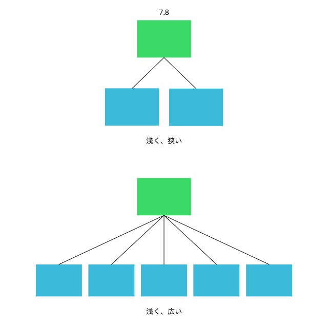

#### 7.2 継承可能なコードを書く

##### アンチパターン

1. オブジェクトがtype やcategory という変数名を使い、どんなメッセージをself に送るかを決めているパターン

この場合、オブジェクトには関連度が高いものの、わずかに型の異なるオブジェクトが含まれている

クラスによる継承を使うように再構成できる。共通のコードは抽象スーパークラスに置き、サブクラスを使って異なる型を作る

2. メッセージを受け取るオブジェクトのクラスを確認してから、どのメッセージを送るかをオブジェクトが決めているパターン

これは、ダックタイプを見落としている

インターフェースだけでなく、ダックタイプは振る舞いまで共有することもある

その場合、共通のコードはモジュールに置き、そのモジュールをそれぞれのクラスやオブジェクトにインクルードすることでロールを担わせる

##### 抽象に固執する

抽象スーパークラス内のコードを使わないサブクラスがあってはいけない

全てのサブクラスでは使わないけれど一部のサブクラスでは使う、というようなコードはスーパークラスに置くべきではない

この制約は、モジュールでも同様である。モジュールのコードを一部だけ使うようなオブジェクトがあってはならない

##### 契約を守る

サブクラスは「契約」に同意する。スーパークラスと置換できることを約束する

サブクラスはスーパークラスのインターフェースに含まれるどのメッセージが来ても応えられるべきであり、同じ種類の入力を取り、同じ種類の出力を行わなければならない

##### リスコフの置換原則 (LSP)

提唱者はBarbara Liskov

SOLID の「L」にあたるもの

> 型がT であるオブジェクトx について証明できる属性を q(x) と表す。この時、型がS であるオブジェクトy について q(x) が真となる。
ただし、型S は型T の派生型であるとする

「システムが正常であるためには、派生型は、上位型と置換可能でなければならない」と言っていると理解すればよいでしょう

##### テンプレートメソッドパターンを使う

テンプレートメソッドパターンを使うと、抽象を具象から分けることができる

抽象コードでアルゴリズムを定義し、抽象を継承する具象では、テンプレート化されたメソッドをオーバーライドすることで特化を行う

##### 前もって疎結合にする

継承する側でsuper を呼び出すようなコードを書くのは避ける。代わりにフックメッセージを使う

抽象クラスのアルゴリズムを知っておく責任からは解放されながらも、アルゴリズムに加わることはできる

##### 階層構造は浅くする

浅く狭い階層構造は簡単に理解できる。浅く広い階層構造はそれよりは若干ゃ複雑

深い階層構造の問題点は、メッセージを解決するための探索パスがとても長くなること

探索パス上にオブジェクトが多いとメッセージが通過するオブジェクトも増える。振る舞いが追加される機会も格段に増える
