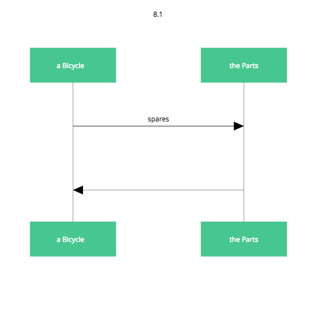
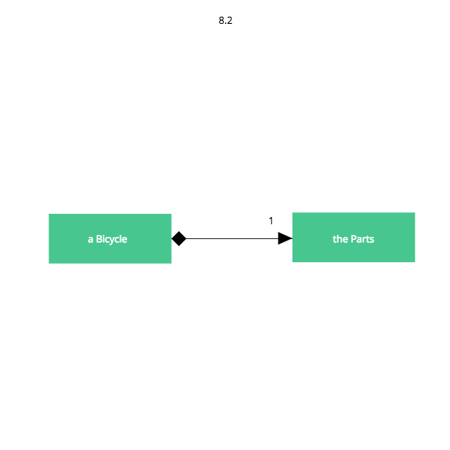
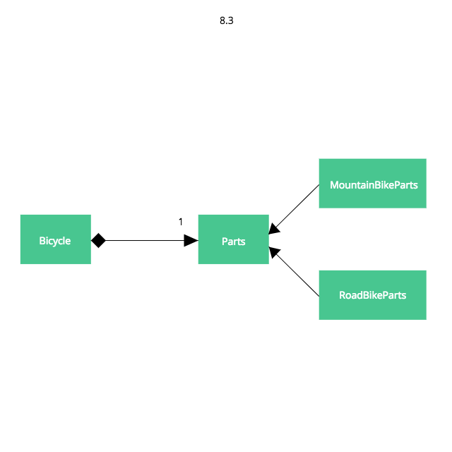

### 第８章 コンポジションでオブジェクトを組み合わせる

コンポジションとは、組み合わされた全体が、単なる部品の集合以上となるように、個別の部品を複雑な全体へと組み合わせる（コンポーズする）行為

コンポジションにおいては、より大きいオブジェクトとその部品が、「has-a」の関係によって繋げられる

自転車にはパーツ (parts) がある。包含するほうのオブジェクトが自転車であり、パーツは自転車に包含される

インターフェースを介してパーツと情報交換する

#### 8.1 自転車をパーツからコンポーズする

##### Bicycle クラスを更新する



全てのBicycle がParts オブジェクトを必要とする。Bicycle であるということは、Parts を持つ (Bicycle have-a Parts である) ことを意味する



この黒い菱形は、「コンポジション」を示し、Bicycle がParts からコンポーズされるものであることを意味する

Parts 側の「１」は、Bicycle １つにつきParts がただ１つあるということ

```ruby
class Bicycle
  attr_reader :size, :parts

  def initialize(args={})
    @size = args[:size]
    @parts = arts[:parts]
  end

  def spares
    parts.spares
  end
end
```

Bicycle の責任は３つ

1. size を知っておくこと
2. 自身のParts を保持すること
3. spares に応えること

##### Parts階層構造を作る

```ruby
class Bicycle
  attr_reader :size, :parts

  def initialize(args={})
    @size = args[:size]
    @parts = args[:parts]
  end

  def spares
    parts.spares
  end
end

class Parts
  attr_reader :chain, :tire_size

  def initialize(args={})
    @chain = args[:chain] || default_chain
    @tire_size = args[:tire_size] || default_tire_size
    post_initialize(args)
  end

  def spares
    { tire_size: tire_size, chain: chain }.merge(local_spares)
  end

  def default_tire_size
    raise NotImplementedError
  end

  # subclasses may override
  def post_initialize(args)
    nil
  end

  def local_spares
    {}
  end

  def default_chain
    '10-speed'
  end
end

class RoadBikeParts < Parts
  attr_reader :tape_color

  def post_initialize(args)
    @tape_color = args[:tape_color]
  end

  def local_spares
    { tape_color: tape_color }
  end

  def default_tire_size
    '23'
  end
end

class MountainBikeParts < Parts
  attr_reader :front_shock, :rear_shock

  def post_initialize(args)
    @front_shock = args[:front_shock]
    @rear_shock = args[:rear_shock]
  end

  def local_spares
    { rear_shock: rear_shock }
  end

  def default_tire_size
    '2.1'
  end
end
```



RoadBikeParts or MountainBikeParts のどちらを持とうが、自転車は依然として自身のsize とspares を正確に答えられる

```ruby
road_bike = Bicycle.new(size: 'L', parts: RoadBikeParts.new(tape_color: 'red'))
p road_bike.size #=> "L"
p road_bike.spares #=> {:tire_size=>"23", :chain=>"10-speed", :tape_color=>"red"}

mountain_bike = Bicycle.new(size: 'L', parts: MountainBikeParts.new(rear_shock: 'Fox'))
p mountain_bike.size #=> "L"
p mountain_bike.spares #=> {:tire_size=>"2.1", :chain=>"10-speed", :rear_shock=>"Fox"}
```

１つ明らかになったのは、必要だったBicycle 特有のコードがいかに少なかったか、ということ
