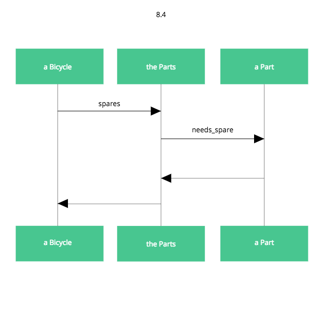

## 8.2 Parts オブジェクトをコンポーズする

すでに単一のオブジェクトを参照するために「parts」という語が使われている

Parts/Part という名前の問題があるが、今はParts オブジェクトがあり、それがPart オブジェクトを複数保持できるだけ、ということにする

### Parts を作る



Parts オブジェクトは、複数のPart オブジェクトからコンポーズされるようになっている


Part 付近の「1..*」は、Parts はPart オブジェクトを、１つ以上持つことを示す

このPart オブジェクトを導入したことにより、既存のParts クラスは簡潔化され、Part オブジェクトの配列を含む簡潔なラッパーとなった

Parts は自身のPart オブジェクトのリストを選別し、スペアが必要なものだけ返す

```ruby
class Bicycle
  attr_reader :size, :parts

  def initialize(args={})
    @size = args[:size]
    @parts = args[:parts]
  end

  def spares
    parts.spares
  end
end

class Parts
  attr_reader :parts

  def initialize(parts)
    @parts = parts
  end

  def spares
    parts.select { |part| part.needs_spare }
  end
end

class Part
  attr_reader :name, :description, :needs_spare

  def initialize(args)
    @name = args[:name]
    @description = args[:description]
    @needs_spare = args.fetch(:needs_spare, true)
  end
end

# 個々のParts オブジェクトを作る
chain = Part.new(name: 'chain', description: '10-speed')
road_tire = Part.new(name: 'tire_size', description: '23')
tape = Part.new(name: 'tape_color', description: 'red')
mountain_tire = Part.new(name: 'tire_size', description: '2.1')
rear_shock = Part.new(name: 'rear_shock', description: 'Fox')
front_shock = Part.new(name: 'front_shock', description: 'Manitou', needs_spare: false)

# ロードバイクのPart オブジェクトを組み合わせて、最適なParts を作る
road_bike_parts = Parts.new([chain, road_tire, tape])

# Bicycle を作る際に、その場でParts オブジェクトを作る
road_bike = Bicycle.new(size: 'L', parts: Parts.new([chain, road_tire, tape]))

p road_bike.size
p road_bike.spares
# "L"
# [#<Part:0x007ff41183e340 @name="chain", @description="10-speed", @needs_spare=true>, #<Part:0x007ff41183e228 @name="tire_size", @description="23", @needs_spare=true>, #<Part:0x007ff41183e110 @name="tape_color", @description="red", @needs_spare=true>]

mountain_bike = Bicycle.new(size: 'L', parts: Parts.new([chain, mountain_tire, front_shock, rear_shock]))

p mountain_bike.size
p mountain_bike.spares
# "L"
# [#<Part:0x007fb7fc06e0a8 @name="chain", @description="10-speed", @needs_spare=true>, #<Part:0x007fb7fc06db80 @name="tire_size", @description="2.1", @needs_spare=true>, #<Part:0x007fb7fc06d860 @name="rear_shock", @description="Fox", @needs_spare=true>]
```

### Parts オブジェクトをもっと配列のようにする

Bicycle のparts, spares メソッドは同じ種類のものを返すべきだが、今の時点では戻ってくるオブジェクトは同じように振る舞わない

```ruby
# spares は (Part オブジェクトの) 配列を返すので、Array はsize を理解できる
p mountain_bike.spares.size #=> 3
# parts はParts のインスタンスを返す。size を理解できない
p mountain_bike.parts.size
# undefined method `size' for #<Parts:0x007fa3c98b52a8> (NoMethodError)
```
-----

Parts にsize メソッドを追加してみる

```ruby
def size
  parts.size
end
```

この変更を加えると今度はParts に対してeach, sort, Array と全てのメソッドに応答して欲しくなる

-----

そこで、Array を継承してみる

```ruby
class Parts < Array
  def spares
    select { |part| part.needs_spare }
  end
end
```

```ruby
# Parts < Array の場合
# ２つのParts は加え合わせることができる
combo_parts = (mountain_bike.parts + road_bike.parts)

# '+' は間違いなくParts を組み合わせる
p combo_parts.size #=> 7

# しかし'+' が返すオブジェクトは'spares' を理解しない
p combo_parts.spares
# undefined method `spares' for #<Array:0x007ffa87061100> (NoMethodError)

p mountain_bike.parts.class #=> Parts
p road_bike.parts.class #=> Parts
p combo_parts.class #=> Array (!!)
```

-----

size, each を自身の@parts 配列に移譲し、走査と検索のための共通のメソッドを得るために、Enumerable をインクルードしている

```ruby
class Parts
  extend Forwardable
  def_delegators :@parts, :size, :each
  include Enumerable

  def initialize(parts)
    @parts = parts
  end

  def spares
    select { |part| part.needs_spare }
  end
end
```

```ruby
# Enumerable をインクルード
# '+' には応答しない
# combo_parts = (mountain_bike.parts + road_bike.parts)
# undefined method `+' for #<Parts:0x007fabe7116d28> (NoMethodError)

# spares, parts の両方がsize に応答できるようになった
p mountain_bike.spares.size #=> 3
p mountain_bike.parts.size #=> 4
```
