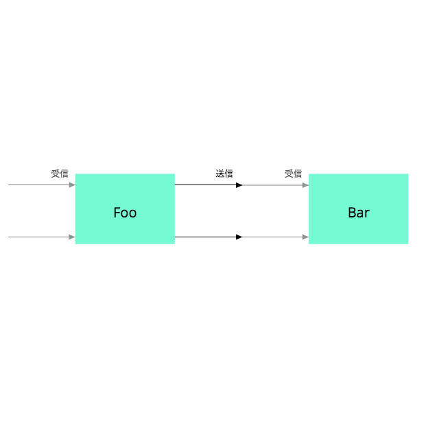
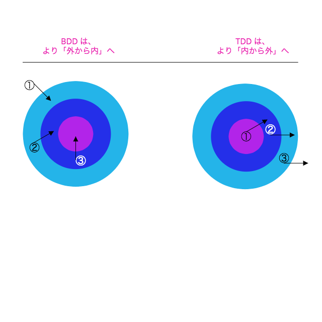

### 第９章 費用対効果の高いテストを設計する

変更可能なコードを書くことに欠かせない３つのスキル

1. オブジェクト指向設計の理解
2. コードのリファクタリングに長けている

> リファクタリングとは、ソフトウェアの外部の振る舞いを保ったままで、内部の構造を改善していく作業を指します

*Martin Fowler 『新装版 リファクタリングー既存のコードを安全に改善する』（児玉公信・友野晶夫・平澤章・梅澤真史 共訳、オーム社、2014）*

リファクタリングは、小さく、蟹のような歩みで、インクリメンタルに、慎重に、コードを変えていく厳密なプロセスである

3. 価値の高いテストを書く能力

#### 9.1 意図を持ったテスト

テストをすることの真の目的は、設計の真の目的がまさにそうであるように、コストの削減である

テストにコストがかかることの解決方法は、テストを止めることではない。上手くなることである

##### テストの意図を知る

◉ バグを見つける

できること（もしくはできないこと）を初期段階で知ることは、将来利用可能な設計の選択肢を変えるために、今の案ではない他の案を選択し直すきっかけとなることもある

◉ 仕様書となる

テストは、唯一信用できる設計の仕様書となる

一度は把握していた説明を思い出させてくれるようなテストを書く

◉ 設計の決定を遅らせる

テストによって、設計の決定を安全に遅らせることができる

テストがインターフェースに依存している場合、その根底にあるコードは、奔放にリファクタリングできる

テストは、そのインターフェースが正しく振る舞い続けることを証明するので、根底にあるコードを変更しても、テストの書き直しが求められることはない

◉ 抽象を支える

良い設計は自然と、抽象に依存する、独立した小さなオブジェクトの集まりになっていく

適切に設計されたアプリケーションの振る舞いは、徐々にそれらの抽象が相互作用した結果となっていく

◉ 設計の欠陥を明らかにする

コストを下げるテストを実現するためには、対象のアプリケーションとテストの、両方を適切に設計する必要がある

目標は、可能な限り低いコストでテストの恩恵を全て得ること。この目標を達成するための最適な方法は、問題となることのみをテストする、疎結合のテストを書くこと

##### 何をテストするかを知る

テストからより良い価値を得るための１つの単純な方法は、より少ないテストを書くこと。どのテストも一度だけ、それも適切な場所で行うようにする

テストから重複を取り除くことで、アプリケーションの変更に伴うテストの変更コストが下がる

また、テストを適切な場所に配置することで、間違いなく必要な時にのみ、テストが変更されることが保証される

テストをその本質へと抽出するには、何をテストしようとしているのかについて、明確な考えを持っていなければならない

この図のように、適切に設計されたオブジェクトはとても強固な境界を持つ

外部にいる誰も内部を覗くことができず、内部にいる誰も決して外部を見ることができない

わずかばかりある明示的に合意されたメッセージのみが、あらかじめ定められた気密室を通ることができる

テストは、オブジェクトの境界に入ってくる（受信する）か、出ていく（送信する）メッセージに集中すべき

Foo は自身のインターフェースをテストする責任があり、メッセージの戻り値について表明（アサーション）をすることでそれを行なっている

メッセージの戻り値について表明をするテストは、状態のテストである。このようなテストは一般的に、メッセージが戻す結果が、期待する値と等しくなることを表明する

Foo からBar に送られるメッセージは、Bar にとっては受信メッセージである。これはBar のパブリックインターフェースの一部であるため、状態のテストは全てBar にとどめられるべき

Foo はそれらの送信メッセージを、状態のためにテストする必要はなく、するべきでもない

オブジェクトは、自身のパブリックインターフェースを構成するメッセージに対して「のみ」、状態についての表明を行うべき

送信メッセージには、副作用が全くないものもある。「クエリ（質問）」というメッセージは、受け手のパブリックインターフェースの一部であり、必要な状態テストは全てそちらで実装する

多くの送信メッセージはアプリケーションが依存するものに対して副作用を持つ

- ファイルの書き込み
- データベースへの記録の保存
- オブザーバーによってアクションが起こされる

これらのメッセージは「コマンド（命令）」であり、それらが適切に送られたことを証明するのは送り手のオブジェクトの責任

メッセージが送られたことの証明は、振る舞いのテストであり、状態のテストではない

- 受信メッセージは、その戻り値の状態がテストされるべき
- 送信コマンドメッセージは、送られたことがテストされるべき
- 送信クエリメッセージは、テストするべきではない

送信コマンドメッセージをテストする時、送られることのみを証明するためにテストを行うのであれば、結合が緩いテストとなり、アプリケーションの変更に対しても耐えることができる

##### いつテストをするかを知る

テストを最初に書くと、オブジェクトに初めから多少の再利用性を持たせることになる

気をつけなくてはならないのは、テストを最初に書いても、適切に設計されたアプリケーションの代替にも保証にもならないということ

適切な時間に、適切な量で終われば、テストをすることと、テストファーストでコードを書くことは、全体的なコストを下げる

これらの利益を得るためには、オブジェクト指向設計の原則をあらゆるところに適用し、アプリケーションのコードとテストコードの両方に適用する必要がある

経験を積んだ設計者は、問題に対し「スパイクを打つ」ということを知っている。スパイクを打つとは、コードだけを書き、実験をするということ

こういった実験は予備的なもので、解決法が不確かな問題の時に実施される

##### テストの方法を知る

テスト駆動開発 (TDD : Test Driven Development) と振る舞い駆動開発 (BDD : Behavior Driven Development) がある

両者は対立するもののように見えるかもしれないが、連続体として見るのが最も良い

BDD は外から内へのアプローチをとり、アプリケーションの境界でオブジェクトを作り、内向きに入っていく

まだ書かれていないオブジェクトを用意するために、モックが必要となる

TDD は、内から外へのアプローチをとる。通常、ドメインオブジェクトのテストから始まり、それらの新しく作られたドメインオブジェクトをコードの隣接するレイヤーのテストで再利用していく

テストをする時には、アプリケーションのオブジェクトを大きく２つのカテゴリに分けて考えることができる

1. 自身がテストをするオブジェクト 「テスト対象オブジェクト」
2. その他のもの全て

１つ目についてはテスト対象オブジェクトを知っている必要があるが、２つ目についてはテストは可能な限り無知であり続けるべき
