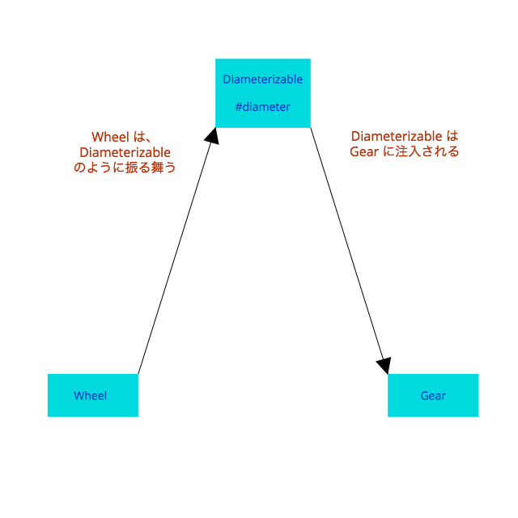

#### 9.2 受信メッセージをテストする

第３章で暑かった、絡み合った状態の頃のWheel とGear クラス

```ruby
class Wheel
  attr_reader :rim, :tire

  def initialize(rim, tire)
    @rim  = rim
    @tire = tire
  end

  def diameter
    rim + (tire * 2)
  end

  # ...
end

class Gear
  attr_accessor :chainring, :cog, :rim, :tire

  def initialize(args)
    @chainring = args[:chainring]
    @cog = args[:cog]
    @rim = args[:rim]
    @tire = args[:tire]
  end

  def gear_inches
    ratio * Wheel.new(rim, tire).diameter
  end

  def ratio
    chainring / cog.to_f
  end
  # ...
end
```

- Gear は自身の奥深く、gear_inches メソッド内でWheel のインスタンスを作っている
- Wheel は１つの受信メッセージ、diameter に応答する（裏を返せば、Gear の送信メッセージ）
- Gear は２つの受信メッセージ、gear_inches, ratio に応答する

| オブジェクト  | 受信メッセージ | 送信メッセージ | 依存されているか？ |
|------------ |-------------|-------------|-----------------|
| Wheel       | diameter    |             |  Yes            |
| Gear        |             | diameter    |  No             |
| Gear        | gear_inches |             |  Yes            |
| Gear        | ratio       |             |  Yes            |


##### 使われていないインターフェースを削除する

受信メッセージには、必ずそこに依存するものがある

依存されていない受信メッセージのテストをしてはいけない。そのメッセージは削除すること

活発に使われていないコードを容赦なく排除していくことで、アプリケーションは改善される

消すことが嬉しいにしろ辛いにしろ、使われないコードは削除する

使われていないコードは、復旧するより残し続けるコストのほうが高い

##### パブリックインターフェースを証明する

受信メッセージは、その実行によって戻される値や状態を表明することでテストされる

受信メッセージをテストするにあたり、第一に求められることは、考えられうる全ての状況において正しい値を返すことを証明すること

-----

Wheel のインスタンスを作成、Wheel のdiameter (直径)が29であることを表明 (assert) している

```ruby
require 'test/unit'

class WheelTest < Test::Unit::TestCase
  def test_calculates_diameter
    wheel = Wheel.new(26, 1.5)

    # https://docs.ruby-lang.org/ja/2.0.0/method/MiniTest=3a=3aAssertions/i/assert_in_delta.html
    # assert_in_delta(expected, actual, delta = 0.001, message = nil) -> true[permalink][rdoc]
    # 期待値と実際の値の差の絶対値が与えられた絶対誤差以下である場合、検査にパスしたことになります。
    assert_in_delta(29, wheel.diameter, 0.01)
  end
end

class GearTest < Test::Unit::TestCase
  def test_calculates_gear_inches
    gear = Gear.new(chainring: 52,
                    cog: 11,
                    rim: 26,
                    tire: 1.5)
    assert_in_delta(137.1, gear.gear_inches, 0.01)
  end
end
```

##### テスト対象のオブジェクトを隔離する

```ruby
class Gear
  attr_accessor :chainring, :cog, :wheel

  def initialize(args)
    @chainring = args[:chainring]
    @cog = args[:cog]
    @rim = args[:rim]
    @wheel = args[:wheel]
  end

  def gear_inches
    # 'wheel' 変数内のオブジェクトが
    # 'Diameterizable' ロールを担う
    ratio * wheel.diameter
  end

  def ratio
    chainring / cog.to_f
  end
  # ...
end
```

Gear はもはや注入されるオブジェクトのクラスについて気にしなくなり、単にdiameter が実装されていることのみを想定している

このdiameter メソッドはDiameterizable と呼ぶのがふさわしいであろう「ロール」のパブリックインターフェースの一部となった

注入されるオブジェクトがそのロールのインスタンスだと考えることによって、テスト中にGear へ注入するDiameterizable の種類によって、より多くの選択肢を考えられるようになる

Wheel のインスタンスをテスト中に注入するように設定する

```ruby
require 'test/unit'

class GearTest < Test::Unit::TestCase
  def test_calculates_gear_inches
    gear = Gear.new(chainring: 52,
                    cog: 11,
                    wheel: Wheel.new(26, 1.5))
    assert_in_delta(137.1, gear.gear_inches, 0.01)
  end
end
```

##### クラスを使って依存オブジェクトを注入する

例： Wheel クラスのdiameter メソッドをwidth という名前に変更する

```ruby
class Wheel
  attr_reader :rim, :tire

  def initialize(rim, tire)
    @rim  = rim
    @tire = tire
  end

  def width # 以前はdiameter
    rim + (tire * 2)
  end

  # ...
end
```

しかし、Gear 内にて送られるメッセージの名前を更新し忘れた

```ruby
class Gear
  attr_accessor :chainring, :cog, :wheel

  def initialize(args)
    @chainring = args[:chainring]
    @cog = args[:cog]
    @rim = args[:rim]
    @wheel = args[:wheel]
  end

  def gear_inches
    # 'wheel' 変数内のオブジェクトが
    # 'Diameterizable' ロールを担う
    ratio * wheel.diameter # 名前をwidth に変更するのを忘れていた！
  end
  # ...
end
```

テストが失敗するようになる

```sh
Error: test_calculates_diameter(WheelTest): NoMethodError: undefined method `diameter' for #<Wheel:0x007fcc6e087978 @rim=26, @tire=1.5>

Error: test_calculates_gear_inches(GearTest): NoMethodError: undefined method `diameter' for #<Wheel:0x007faa80130bc8 @rim=26, @tire=1.5>
```

##### ロールとして依存オブジェクトを注入する

Gear とWheel は両方とも第三のもの、Diameterizable と関連している



1. Gear は、自身がDiameterizable のインターフェースを知っていると思っている
2. Wheel がdiameter を実装していることを想定している

「依存オブジェクトの注入」の本質は、それにより、既存のコードを変更することなく異なる具象クラスへの差し替えができるようになること

◉ テストダブルを作る

Diameterizable のロールを担うフェイクオブジェクト「テストダブル」を作る


```ruby
require 'test/unit'

# 'Diameterizable' ロールの担い手を作る
class DiameterDouble
  def diameter
    10
  end
end

class GearTest < Test::Unit::TestCase
  def test_calculates_gear_inches
    gear = Gear.new(chainring: 52,
                    cog: 11,
                    wheel: DiameterDouble.new) # ここで注入
    assert_in_delta(47.27, gear.gear_inches, 0.01)
  end
end
```

テストダブルとは、ロールの担い手を様式化したインスタンスであり、テストでのみ使われるもの

このダブルは、diameter を「スタブ」する、あらかじめ詰められた答えを返すdiameter を実装する

diameter がいつでも10を返すという事実が、うってつけである

このスタブされた戻り値は、テストをその上に構築するための、依存可能な基礎を提供してくれる

このダブルを注入することでGear のテストをWheel クラスから切り離せる

◉ 夢の世界に生きる

再度前の変更を加える

- Diameterizable のインターフェースをdiameter -> width に変更
- Wheel は更新されたが、Gear はそのまま

```ruby
class GearTest < Test::Unit::TestCase
  def test_calculates_gear_inches
    gear = Gear.new(chainring: 52,
                    cog: 11,
                    wheel: DiameterDouble.new)
    assert_in_delta(47.27, gear.gear_inches, 0.01)
    # DiameterDouble を注入しているので、テストが通ってしまう
  end
end
```

アプリケーションが壊れているにもかかわらず、テストが通り続ける

◉ テストを使ってロールを文書化する

Diameterizable ロールの可視性を高めるためにWheel がそれを担うことを表明する

```ruby
class WheelTest < Test::Unit::TestCase
  def setup
    @wheel = Wheel.new(26, 1.5)
  end

  def test_implements_the_diameterizable_interface
    assert_respond_to(@wheel, :diameter) # Wheel がdiameter に応答できることをテスト
  end
  # ...
end
```

- このテストは他のDiameterizable と共有できない
- Gear のDiameterDouble が過去のものになってしまい、gear_inches テストが間違って通ってしまうことは防げない
